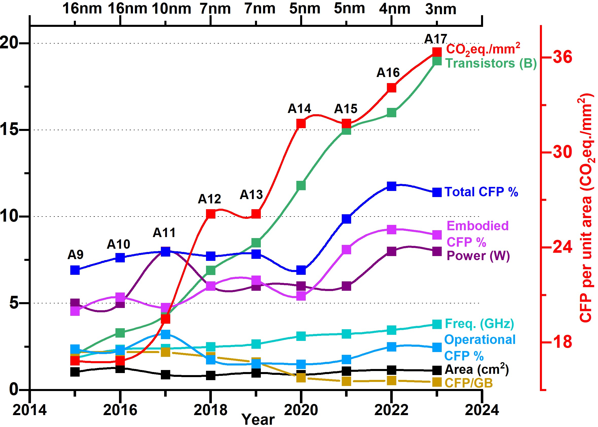
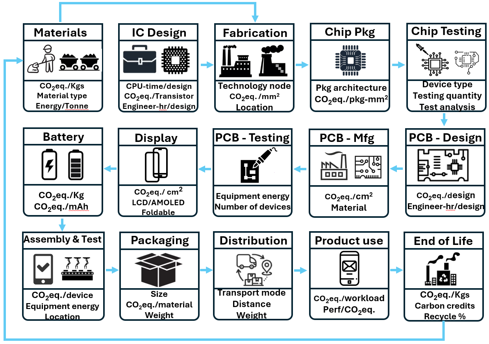

# Mobile Processor Carbon Footprint Trend

## Beyond the Surface: The Necessity of Detailed Metrics in Corporate Sustainability (IGSC'24)

The smartphone industry’s push for smaller, energy-efficient devices with advanced features often overlooks environmental impacts. Corporate sustainability reports provide broad overviews, masking critical details, especially about carbon footprints (CFP) of components like processors. This paper examines the gap between reported CFP trends and the rising CFP contributions of processors, highlighting deficiencies in reporting practices. We propose specific metrics to improve transparency and guide chip design and manufacturing toward sustainable solutions.

  

## Table of Contents

-   [Directory structure](#directory-structure)
-   [Main objective](#main-objectives)
-   [Dataset](#dataset)

## Directory Structure 

- **[ECO-CHIP](./ECO-CHIP/)** [Submodule to original ECO-CHIP]
- **src/**
  - [ECO_chip.py](./src/ECO_chip.py) [Modified version of original ECO_chip.py to help with Mobile processor metric work] 
- **data**
  - [Apple-iPhone-Series.xlsx](./data/Apple-iPhone-Series.xlsx)
  - [Goole-Pixel-Series.xlsx](./data/Google-Pixel-Series.xlsx)
- [README.md](README.md)
- **images**
  - [Mobile-Sustainability-LCA.png](./images/Mobile-Sustainability-LCA.png)
  - [Sustainability-MobileProcessor-Trend.jpg](./images/Sustainability-MobileProcessor-Trend.jpg)

## Main Objectives
Two main objectives of this work are : 
### Call to action for industry to include detailed data in sustainability reports 
  

### Call to action for the community to incorporate sustainability-oriented metrics for benchmarking chips and architectures
- #### Performance Sustainability Index (Perf-SI)
The performance sustainability index provides information about how much performance we get for every CO2eq. The key thing to note here is the total CFP considers the contribution of both embodied and operational CPF.
When comparing devices, just performance alone is not sufficient. We need to consider the device’s area, power, and sustainability impact together with performance. 

$\Large Perf - SI = \frac{Performance}{Total CO_2 eq.}$


- #### Workload-depended carbon footprint
There has been increased demand for computing in recent years, which makes it important to evaluate workload-dependent CFP. 

$\Large C_{workload} = T_{workload} \times P \times CI$

$T_{workload}$ - Time takne to run the workload  

$P$ - power of the processor 

$CI$ - Carbon intensity 

- #### Carbon footprint per billion transistor
CFP per billion transistors is another metric that can be used to see the progress being made from a fab perspective. 

- #### Carbon footprint per GB
Important for companies to include CFP per GB in their reports. 

## Dataset 
We have uploaded the entire Google Pixel series, and iPhone series processor specifications and sustainability-related carbon footprint details of both the processor and the entire phone under **data** directory [[1]][Apple-reports] [[2]][Google-reports]
### Apple Processor Data
- [Apple-iPhone-Series](./data/Apple-iPhone-Series.xlsx) contains details for iPhone series processors
### Google Processor Data
- [Google-Pixel-Series](./data/Google-Pixel-Series.xlsx) contains details for the Google Pixel series processors

## Citation

If you find our work **Mobile-Processor-Carbon** useful or relevant to your research, please kindly cite our paper:

```bibtex
@inproceedings{sudarshan2024igsc,
author = {Chetan Choppali Sudarshan, Aman Arora, Vidya A. Chhabria},
title = {Beyond the Surface: The Necessity of Detailed Metrics in Corporate Sustainability},
year = {2024},
booktitle = {Proceedings of the 15th International Green and Sustainable Computing Conference},
location = {Austin, US},
series = {IGSC '24}
}

```

[Apple-reports]: <https://www.apple.com/environment/>
[Google-reports]: <https://sustainability.google/reports/>
